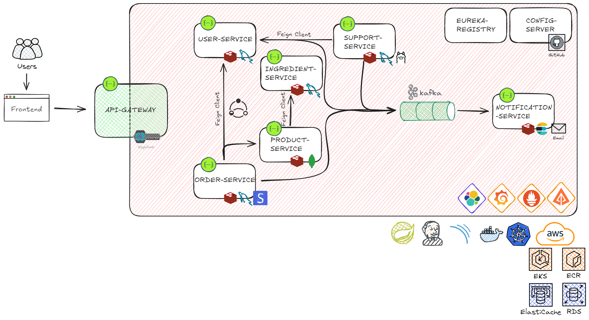

# SonnettoPizza
This project is a pizza shop application designed using a microservices architecture, built on Spring Boot. It is deployed on AWS EKS, but can also be run locally using Kubernetes with the included start.sh script.

## Services Overview:
- ### Eureka Server Registry
   URL: /eureka/web
   Service Discovery and Registry for microservices.
- ### Config Server
   Provides centralized configuration for all services (except eureka-server).
- ### API Gateway
   Port: 8080
   Implements Keycloak for authentication and acts as a gateway for routing requests to various services.
- ### User Service
   URL: /api/v1.0/users
   Databases: MySQL for persistence, Redis for caching.
   Message Broker: Kafka.
   Handles user-related data.
- ### Ingredient Service
   URL: /api/v1.0/ingredients
   Databases: MySQL for persistence, Redis for caching.
   Manages the ingredients used in dish creation.
- ### Product Service
   URL: /api/v1.0/products
   Databases: MongoDB for persistence, Redis for caching.
   Utilizes OpenFeign for inter-service communication.
   Handles product-related data (pizza, pastas, drinks, etc).
- ### Order Service
   URL: /api/v1.0/orders
   Databases: MySQL for persistence, Redis for caching.
   Message Broker: Kafka.
   Additional Features: Resilience4J Circuit Breakers, Stripe for payments.
   Handles order placement and payment processing.
- ### Support Service
   URL: /api/v1.0/support
   Databases: MySQL for persistence, Redis for caching.
   Message Broker: Kafka.
   Utilizes OpenFeign and Ollama for customer support-related queries.
- ### Notification Service
   URL: /api/v1.0/notifications
   Databases: Elasticsearch for persistence, Redis for caching.
   Message Broker: Kafka.
   Sends notifications via email using Spring Mail.
---
## Additional Technologies:
- ### ELK Stack
  Used for centralized logging and analysis.
- ### Prometheus + Grafana
  For monitoring and alerting.
- ### Zipkin
  Distributed tracing.
- ### Jenkins
  CI/CD pipeline for continuous integration and deployment.
- ### SonarQube
  Ensures code quality and performs static code analysis.
- ### Testcontainers, REST Assured, WireMock
  Testing tools for integration and unit testing.
- ### Swagger
  API documentation.
---
## Deployment:
- ### Cloud: 
  Cloud Provider: AWS
  Orchestration: AWS EKS (Elastic Kubernetes Service)
  Databases: AWS RDS, AWS ElastiCache, MongoDB Atlas, AWS EC2 (for ELK)
- ### Local Development:
  To run the project locally, follow the steps in the **start.sh script**. This script handles Docker image creation, Kubernetes cluster creation, and microservices deployment.
